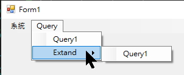

## 目的
透過 xml 設定 Menu，設定內容包含 MenuItem、權限，MenuItem 可控制要開啟的 Form

## XML
```xml
<Menu>
	<Node Title="系統">
		<Node Title="Login" Type=".Menu.Login" ViewMode="NotLogin">
		</Node>
		<Node Title="Logout" Type=".Menu.Logout" ViewMode="OnlyLogin"></Node>
	</Node>
	<Node Title="Query">
		<Node Title="Query1" Type=".Menu.Query"></Node>
		<Node Title="Extand">
			<Node Title="Query1" ViewMode="Limit"></Node>
		</Node>
		<Node Title="QueryOnlyLogin" Type=".Menu.Query" ViewMode="Login" AccessString=":Query"></Node>
		<Node Title="QueryOnlyLimit" Type=".Menu.Query" ViewMode="Limit" AccessString="User:QueryX"></Node>
	</Node>
	<Node Title="Query2">
		<Node Title="Extand">
			<Node Title="QueryOnlyLimit" Type=".Menu.Query" ViewMode="Limit" AccessString=":Query"></Node>
		</Node>
		<Node Title="QueryOnlyLimit" Type=".Menu.Query" ViewMode="Limit" AccessString=":Query"></Node>
	</Node>
</Menu>
```

Type: 要執行的 MenuItem，由 「.」開頭表示為目前組件下的 namespace，否則為完整組件名稱，底下兩者結果相同
> Type=".Menu.Login"
> Type="WinMenu.Menu.Login"

ViewMode:
- Always: 預設，總是顯示、不檢查權限
- Login: 限制登入才可使用，顯示灰底、不可操作
- Limit: 限制登入才可使用，否則不顯示
- NotLogin: 未登入狀態下才顯示，用在登入
- OnlyLogin: 登入狀態下才顯示，用在登出

## Menu

